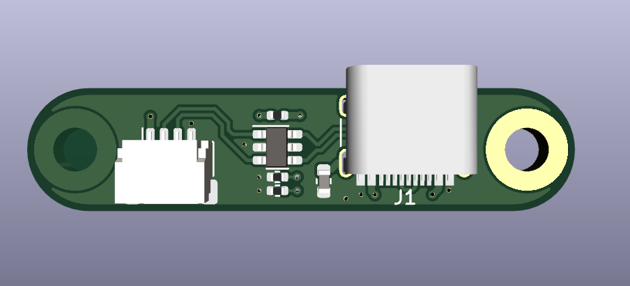
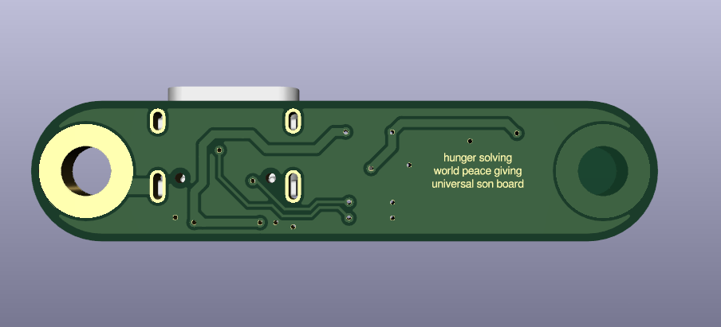

# Uninversal sonboard series #1 slim

I changed a bunch of stuff on the series s UDB because some design changes were needed
- Back to the old JST. Pico EZMate is rated for too few mating cycles
- Different USB routing. I wouldn't recommend running anything higher than USB fullspeed (12mbps) over a long jst w/o shielding. pls don't run high speed usb over a daughterboard
- Different parts. The USBLC6 I used lets you get away without an external ESD diode on your power/ground lines
- Shield ground is chassis ground. Laptop compatibility reasons for instance motivated this change. you can short this with a ferrite bead or a zero ohm resistor to signal ground. If you actually try to get FCC certs for a product using this you can play with it there.
- Some smaller footprints
- Changed to the way cooler squiggly U.S. resistor symbol 🦅🇺🇸🦅🇺🇸🦅🇺🇸🦅🇺🇸

Everything should be just as available on JLC so hav fun =^)

